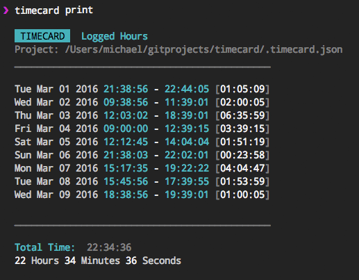

# timecard
> Keep track of your project development time.



## Install 
*Currently testing the global capabilities of timecard. Check back soon for Install instruction.*

## Usage

To create a **new timecard** for your project
```sh
$ timecard new
```

To **clockin** (start working)
```sh
$ timecard clockin
```

To **clockout** (stop working)
```sh
$ timecard clockout
```

To see a **print summary** of your time
```sh
$ timecard print
```

## Options

```
    $ timecard --help
   
    Record your project's development time.

    Get timecard setup with the `new` command, then use the `clockin` and `clockout` commands
    to record your time. When you want to see a summary of your time, use the `print` command.

    Commands
        timecard new            setup a blank timecard for your project
        timecard clockin        set the start time
        timecard clockout       set the end time
        timecard print          print a summary of your time

    Options
        -h, --help              Show this help message
        -v, --version           Show the current timecard version
        
```

## License

MIT @ [Michael Wuergler](http://numetriclabs.com)

