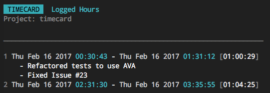

# timecard

> Keep track of your project development time.

[](https://travis-ci.org/radiovisual/timecard) [](https://coveralls.io/github/radiovisual/timecard?branch=master)


## Install
```sh
$ npm install --global timecard
```

## Usage

To create a **new timecard** for your project

```
$ timecard new
```

To **clockin** (start working)

```
$ timecard clockin
```

To **clockout** (stop working)

```
$ timecard clockout
```

To see a **print summary** of your time

```
$ timecard print
```

**Tip:** If you prefer the shorthand, all of these commands have flag aliases. Check the [help output](https://github.com/radiovisual/timecard#options) for details.

## Messages

You can add a message to your shifts via the `clockin` and `clockout` commands.

To add a message, simply include the `-m` or `--message` options with your clockin
and clockout commands. Here are some examples:

```
$ timecard clockin -m "Refactored tests to use AVA"
$ timecard clockout --message "Fixed Issue #23"
```
The two lines above would result in two messages being added to the shift:

;

If you want to add more messages to your shift, you can edit the `.timecard.json`
file manually. In the future, I would like to make it possible to [add/edit messages
to a shift via the cli](https://github.com/radiovisual/timecard/issues/32),
but for now, you can only add one message on clockin, and one message on
clockout for a total of two messages. Pull requests are welcome if anyone would like
to help add these features.

## `.timecard.json`

When you run the `timecard new` command, Timecard creates a hidden file called `.timecard.json`. This is the file
where your project times are recorded.

Some important notes to consider regarding the timecard file:

1) **Version Control:** Remember to update your `.gitignore` file if you don't want the timecard file under version control.

2) **For Node.js developers:** If your project contains a `package.json` file, then Timecard assumes that the directory with the `package.json` file is the root directory, and places the `.timecard.json` file in the root. You can run any Timecard command from any of your project's sub-directories.

3) **Non-Node.js Projects:** (or if your project DOES NOT contain a `package.json` file), then you can still use Timecard, you will just need to make sure that you are running the Timecard commands from the same directory each time (preferably in your project root).

4) **Manual timecard edits:** Sometimes it will be necessary to update the `.timecard.json` file manually (if you forgot to clockout, for example), which is fine, just remember that this file must be valid JSON.


## Options

```
$ timecard --help

  Keep track of your project development time

  Get timecard setup with the 'new' command, then use the 'clockin' and 'clockout' commands
  to record your time. When you want to see a summary of your time, use the 'print' command.

  Commands
    timecard new            Setup a blank timecard for your project
    timecard clockin        Set the start time for your shift
    timecard clockout       Set the end time for your shift
    timecard print          Print a summary of your time

  Options
    -h, --help              Show this help message
    -v, --version           Show the current timecard version
    -i, --clockin           Alias for the clockin command
    -o, --clockout          Alias for the clockout command
    -n, --new               Alias for the new command
    -p, --print             Alias for the print command
    --no-prompt             Use with `new` to silence all prompts and overwrite existing timecard
    --message, -m           Include a message summary to your shift (via clockin and clockout)

```

## License

MIT @ [Michael Wuergler](http://numetriclabs.com)
